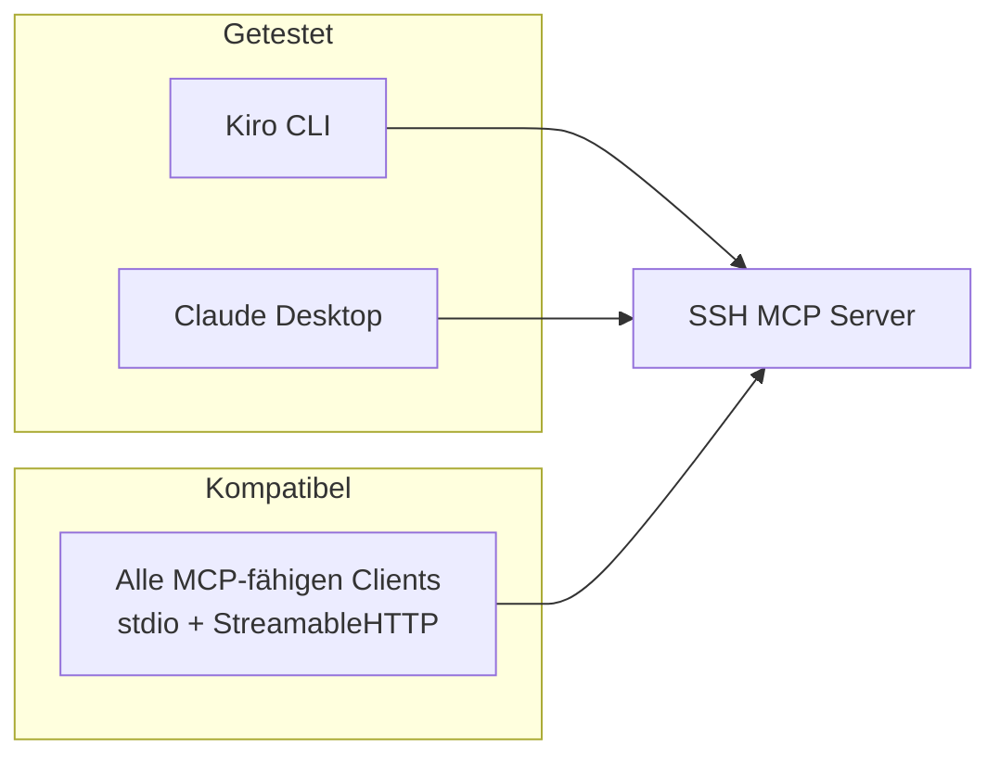
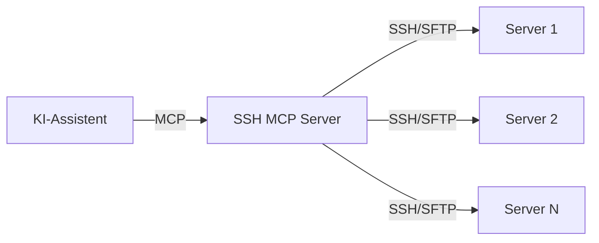

# SSH MCP Server

MCP Server für SSH-basierte Server-Administration. Ermöglicht KI-Assistenten die Verwaltung von Remote-Servern via SSH.

## Supported MCP Clients



| Client | Transport | Status |
|--------|-----------|--------|
| [Kiro CLI](https://github.com/aws/kiro) | stdio | ✅ getestet |
| [Claude Desktop](https://claude.ai/download) | stdio | ✅ getestet |
| Jeder MCP-Client | stdio / StreamableHTTP | ✅ kompatibel |

## Features

Verwalte Linux-Server per SSH — direkt aus dem KI-Assistenten heraus. Keine Agents, Daemons oder Tools auf den Zielservern nötig. Nur ein SSH-Zugang reicht.



- **Agentless**: Kein Setup auf den Zielservern — funktioniert mit jedem SSH-Zugang
- **Remote Command Execution**: Einzelbefehle oder mehrzeilige Scripts ausführen
- **Sudo Support**: Befehle mit `sudo` ausführen, ohne interaktives Passwort
- **File Operations**: Dateien lesen (teilweise/komplett), schreiben, suchen, chirurgisch editieren
- **File Transfer**: Upload/Download via SFTP
- **Service Management**: Systemd Services starten, stoppen, restarten, Status prüfen
- **Code Navigation**: Funktions-/Klassen-Übersicht aus Quelldateien extrahieren (grep-basiert, kein Language Server nötig)
- **Multi-Server**: Beliebig viele Server parallel verwalten
- **Connection Pooling**: SSH-Verbindungen werden 5 Minuten wiederverwendet
- **User Approval**: Schreibende Operationen erfordern Bestätigung durch den Operator
- **Audit Log**: Alle Aktionen werden protokolliert (Pfad konfigurierbar)

## Installation

### Von PyPI

```bash
pip install remote-admin-mcp
```

### Mit uv (empfohlen für Entwicklung)

```bash
# Virtuelle Umgebung erstellen und Abhängigkeiten installieren
uv venv
source .venv/bin/activate  # Windows: .venv\Scripts\activate
uv pip install -e ".[dev]"
```

### Mit pip

```bash
# Virtuelle Umgebung erstellen
python -m venv .venv
source .venv/bin/activate  # Windows: .venv\Scripts\activate

# Abhängigkeiten installieren
pip install -e ".[dev]"
```

## Konfiguration

1. Kopiere `.env.example` zu `.env`:
```bash
cp .env.example .env
```

2. Bearbeite `.env` mit deinen Server-Zugangsdaten:
```bash
SSH_SERVER_1_NAME=production
SSH_SERVER_1_HOST=prod.example.com
SSH_SERVER_1_PORT=22
SSH_SERVER_1_USER=admin
SSH_SERVER_1_PASSWORD=your-password

SSH_SERVER_2_NAME=staging
SSH_SERVER_2_HOST=staging.example.com
SSH_SERVER_2_PORT=22
SSH_SERVER_2_USER=deploy
SSH_SERVER_2_PASSWORD=your-password
```

## MCP Tools

### list_servers
Liste alle konfigurierten Server auf.

### execute_command
Führe einen Befehl auf einem Remote-Server aus.

**Parameter:**
- `server` (string): Server-Name
- `command` (string): Auszuführender Befehl
- `use_sudo` (boolean): Mit sudo ausführen

### read_file
Lese eine Datei vom Remote-Server.

**Parameter:**
- `server` (string): Server-Name
- `path` (string): Dateipfad

### write_file
Schreibe eine Datei auf den Remote-Server.

**Parameter:**
- `server` (string): Server-Name
- `path` (string): Dateipfad
- `content` (string): Dateiinhalt

### get_service_status
Prüfe den Status eines systemd Services.

**Parameter:**
- `server` (string): Server-Name
- `service` (string): Service-Name

### manage_service
Verwalte einen systemd Service (start/stop/restart/reload).

**Parameter:**
- `server` (string): Server-Name
- `service` (string): Service-Name
- `action` (string): Aktion (start/stop/restart/reload)

## Verwendung mit KI-Assistenten

### Kiro CLI / Claude Desktop (uvx — empfohlen)

Kein manuelles Installieren nötig — `uvx` lädt und cached das Paket automatisch:

```json
{
  "mcpServers": {
    "ssh": {
      "command": "uvx",
      "args": ["remote-admin-mcp"],
      "env": {
        "SSH_SERVER_1_NAME": "production",
        "SSH_SERVER_1_HOST": "prod.example.com",
        "SSH_SERVER_1_USER": "admin",
        "SSH_SERVER_1_KEY_FILE": "~/.ssh/id_ed25519"
      }
    }
  }
}
```

### Alternative: Mit .env-Datei

```json
{
  "mcpServers": {
    "ssh": {
      "command": "uvx",
      "args": ["--env-file", "/path/to/.env", "remote-admin-mcp"]
    }
  }
}
```

### Alternative: Lokale Installation

```json
{
  "mcpServers": {
    "ssh": {
      "command": "/path/to/.venv/bin/ssh_mcp_server"
    }
  }
}
```

## Beispiele

**Log-Analyse:**
```
"Zeige mir die letzten 100 Zeilen vom nginx error log auf production"
```

**Service Restart:**
```
"Starte den nginx Service auf staging neu"
```

**Config ändern:**
```
"Lies die nginx.conf auf production und erhöhe worker_processes auf 4"
```

## Sicherheit

- Schreibende Tools erfordern **User-Approval** durch den MCP Client
- Lese-Tools (`list_servers`, `read_file`, `search_in_file`, `get_file_structure`) sind auto-approved
- SSH-Key-Authentifizierung empfohlen (Passwort-Auth möglich)
- `.env` sollte NICHT ins Git committed werden

### Audit Log

Alle Aktionen werden in ein Logfile geschrieben:

```
[2026-04-12 13:14:00] [production] execute: tail -100 /var/log/syslog
[2026-04-12 13:14:05] [production] write_file: /etc/nginx/nginx.conf — Config update
```

Default: `~/.ssh-mcp-audit.log`. Konfigurierbar per Environment-Variable:

```bash
SSH_MCP_AUDIT_LOG=/var/log/ssh-mcp-audit.log
```

## Entwicklung

```bash
# Tests ausführen
pytest -v

# Linting
ruff check src/
```

## Lizenz

MIT — siehe [LICENSE](LICENSE)
