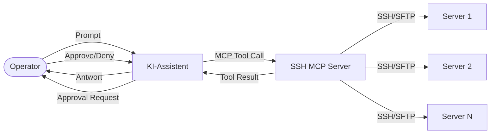
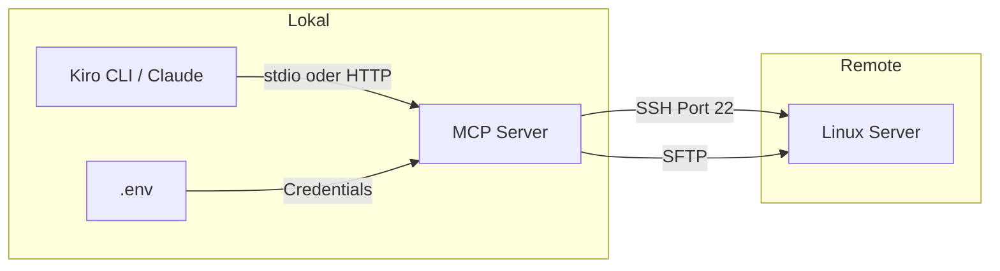
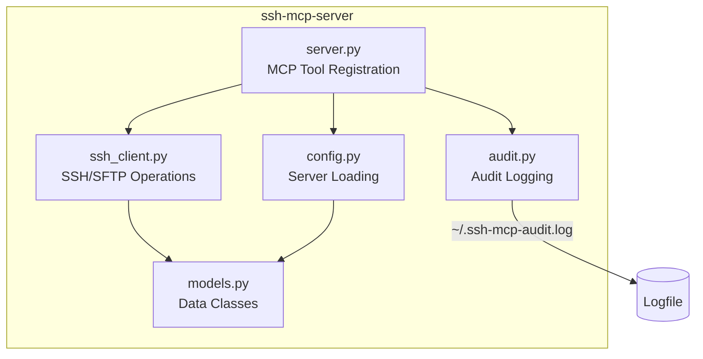
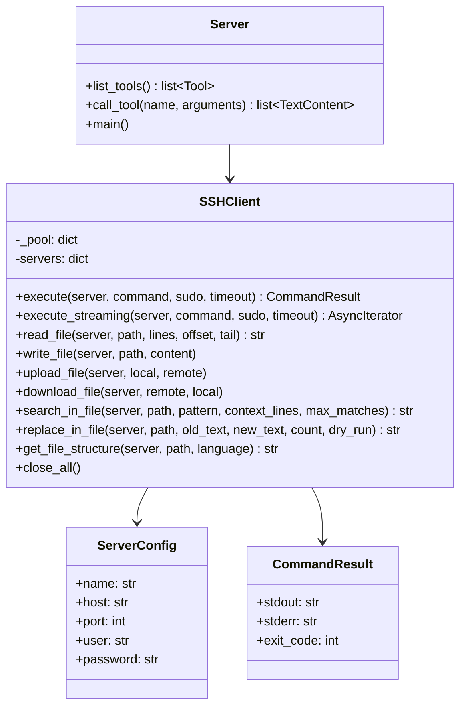
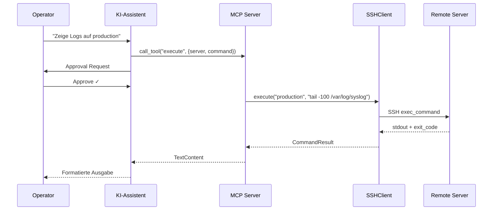
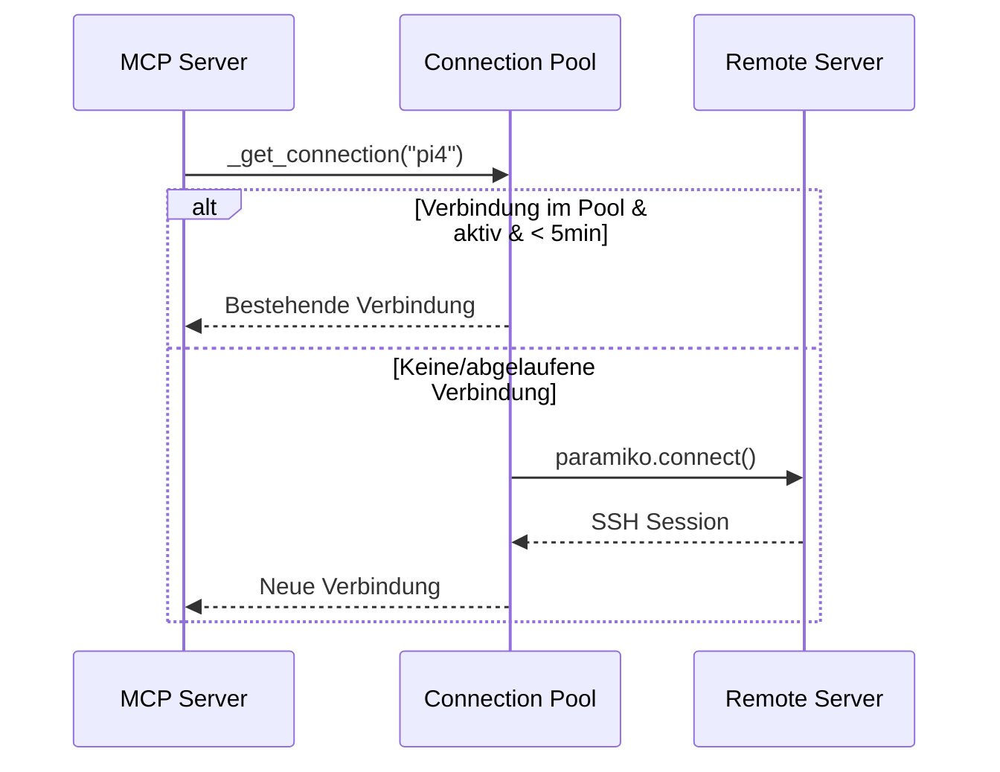
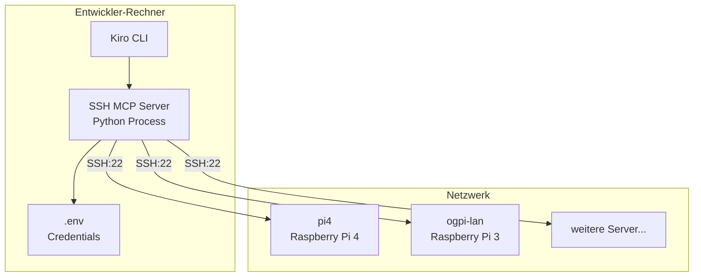
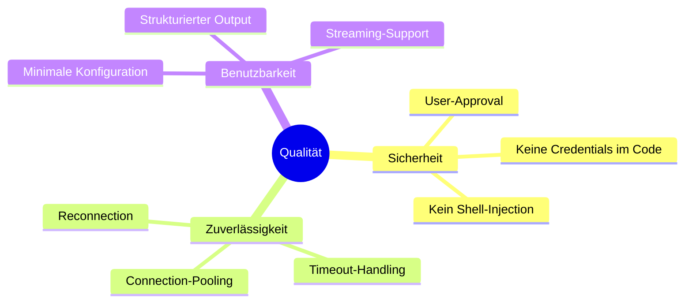

# SSH MCP Server — Architekturdokumentation (arc42)

## 1. Einführung und Ziele

### Aufgabenstellung
Der SSH MCP Server ermöglicht KI-Assistenten (Kiro CLI, Claude Desktop) die Verwaltung von Remote-Servern über SSH. Er implementiert das [Model Context Protocol (MCP)](https://modelcontextprotocol.io/) und stellt 9 Tools für Kommandoausführung, Dateioperationen, Service-Management und effizientes Bearbeiten großer Dateien bereit.

### Qualitätsziele

| Priorität | Ziel | Beschreibung |
|-----------|------|-------------|
| 1 | Sicherheit | Alle schreibenden Operationen erfordern User-Approval |
| 2 | Zuverlässigkeit | Connection-Pooling, Timeout-Handling, Fehlertoleranz |
| 3 | Einfachheit | Minimale Konfiguration via `.env`, kein Setup-Overhead |

### Stakeholder

| Rolle | Erwartung |
|-------|-----------|
| KI-Assistent | Zuverlässige Tool-Aufrufe mit strukturiertem Output |
| Operator | Sichere Remote-Verwaltung mit Approval-Workflow |

---

## 2. Randbedingungen

### Technisch
- Python ≥ 3.10
- MCP SDK (`mcp` Package)
- SSH via `paramiko` (kein Shell-Subprocess)
- Transport: stdio (Standard) oder StreamableHTTP

### Organisatorisch
- DB Inner Source License (DBISL)
- Keine Speicherung von Credentials im Code

---

## 3. Kontextabgrenzung

### Fachlicher Kontext



### Technischer Kontext



---

## 4. Lösungsstrategie

- **MCP als Schnittstelle**: Standardisiertes Protokoll für KI-Tool-Integration
- **paramiko für SSH**: Direkte SSH-Library statt Shell-Subprozesse (sicherer)
- **Connection-Pooling**: Verbindungen werden 5 Minuten wiederverwendet
- **Streaming**: Lange Befehle liefern Output zeilenweise an den Client
- **Tool-Konsolidierung**: Minimale Anzahl Tools (9) um den LLM-Context klein zu halten
- **Large-File-Strategie**: Chirurgische Edits statt Full-File-Rewrite für große Dateien

### Tool-Übersicht

| Tool | Zweck | Auto-Approve |
|------|-------|:---:|
| `list_servers` | Verfügbare Server auflisten | ✓ |
| `execute` | Kommandos oder Scripts ausführen | ✗ |
| `read_file` | Dateien (teilweise) lesen | ✓ |
| `write_file` | Dateien komplett überschreiben | ✗ |
| `transfer_file` | Upload/Download via SFTP | ✗ |
| `service` | Systemd Services verwalten | ✗ |
| `search_in_file` | Pattern-Suche mit Kontext | ✓ |
| `replace_in_file` | Chirurgische Text-Ersetzung | ✗ |
| `get_file_structure` | Funktions-/Klassen-Übersicht | ✓ |

### Large-File-Workflow

Für Dateien >200 Zeilen folgt der KI-Assistent diesem Pattern:

```
1. get_file_structure  → Überblick (Symbole + Zeilennummern)
2. search_in_file      → Relevante Stelle finden
3. read_file (lines+offset) → Nur den Abschnitt lesen
4. replace_in_file     → Chirurgisch ändern
```

`write_file` wird nur für kleine Dateien oder Neuanlage verwendet.

---

## 5. Bausteinsicht

### Ebene 1 — Gesamtsystem



### Ebene 2 — Moduldetails



---

## 6. Laufzeitsicht

### Kommandoausführung



### Connection-Pooling



---

## 7. Verteilungssicht



---

## 8. Querschnittliche Konzepte

### Sicherheit
- **Approval-Workflow**: Schreibende Tools (`execute`, `write_file`, `replace_in_file`, `service`, `transfer_file`) erfordern User-Bestätigung durch den MCP Client
- **Auto-Approve nur für Lese-Tools**: `list_servers`, `read_file`, `search_in_file`, `get_file_structure`
- **Audit-Log**: Alle schreibenden Operationen werden in `~/.ssh-mcp-audit.log` protokolliert (Zeitstempel, Server, Tool, Detail)
- **Credential-Management**: Server-Zugangsdaten in `.env`, nicht im Code
- **Kein Shell-Subprocess**: paramiko nutzt direkte SSH-Kanäle

### Fehlerbehandlung
- Timeout-Erkennung via `timeout`-Wrapper im SSH-Befehl (exit code 124)
- Automatische Reconnection bei abgelaufenen Pool-Verbindungen
- Strukturierte Fehlerausgabe (stdout, stderr, exit code)

### Streaming
- Lange Befehle liefern Output zeilenweise via `execute_streaming`
- MCP Log-Messages für Echtzeit-Feedback an den Client

---

## 9. Architekturentscheidungen

| Entscheidung | Begründung |
|-------------|-----------|
| paramiko statt subprocess | Kein Shell-Injection-Risiko, direkter SSH-Kanal |
| Connection-Pooling (5min TTL) | Vermeidet SSH-Handshake bei aufeinanderfolgenden Befehlen |
| stdio als Default-Transport | Einfachste Integration mit MCP Clients |
| `.env` für Konfiguration | Standard-Pattern, kein eigener Config-Parser nötig |
| Script-Execution via Temp-File | Mehrzeilige Scripts zuverlässig ausführen, Cleanup garantiert |
| 9 konsolidierte Tools | Minimaler LLM-Context, keine redundanten Tools |
| replace_in_file via Python-Helper | SFTP-basierter Helper-Script vermeidet Shell-Escaping bei Multi-Line-Content |
| grep-basierte Dateistruktur | Keine Abhängigkeit auf Language Server, funktioniert auf jedem Server |

---

## 10. Qualitätsanforderungen



---

## 11. Risiken und technische Schulden

| Risiko | Maßnahme |
|--------|----------|
| Passwörter im Klartext in `.env` | Zukünftig: SSH-Key-Authentifizierung |
| Kein Rate-Limiting | Akzeptabel für Single-User-Betrieb |
| Keine Verschlüsselung des HTTP-Transports | Nur für lokalen Betrieb vorgesehen |

---

## 12. Glossar

| Begriff | Bedeutung |
|---------|-----------|
| MCP | Model Context Protocol — Standard für KI-Tool-Integration |
| Tool | Eine vom MCP Server bereitgestellte Funktion |
| Approval | Bestätigung durch den Operator vor Ausführung kritischer Operationen |
| SFTP | SSH File Transfer Protocol |
| Connection Pool | Wiederverwendung bestehender SSH-Verbindungen |
